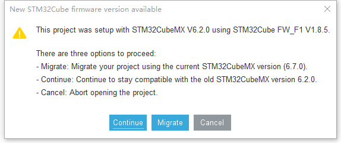

# STM32入门教程配套代码

#### 介绍
致力于最低的成本带你入门单片机

B站视频教程配套代码，
视频录制完成后会将相关的代码更新到这个库中去

b站UP主：一直在入门啊

B站教程链接
https://space.bilibili.com/2044983862

#### 软件架构

cubmx生成代码，keil编译代码

#### 安装教程
部分是6.2的工程生成的，部分是6.7的版本生成的，在打开的时候，点击“Migrate”升级即可

#### 使用说明

cubmx版本：6.2

keil版本：keil5

#### 参与贡献
代码有问题的话可以在B站后台给我留言，会更正。

